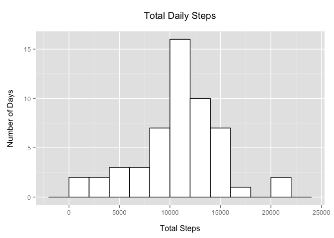
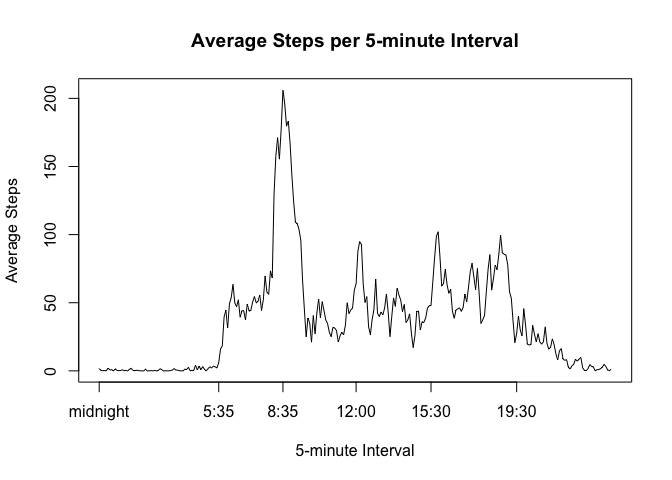
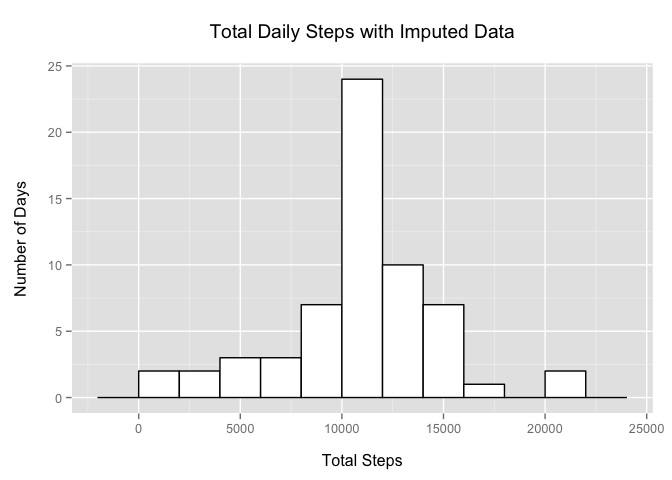

# Reproducible Research: Peer Assessment 1


In this assignment, I will answer several questions about a set of walking activity data for an anonymous individual, described in the README file.  

## Loading and preprocessing the data

Our first step is to load the data and do any initial preprocessing.  

First, let's load the `dplyr` package, which provides convenient methods for grouping, filtering, and summarizing data.  Depending on the configuration of your system, you may see several system messages related to loading `dplyr`.  We'll also load `ggplot2` so that I can make attractive plots.  I will also used the base plotting system.


```r
library(dplyr)      #for easier data summaries
```

```
## 
## Attaching package: 'dplyr'
## 
## The following object is masked from 'package:stats':
## 
##     filter
## 
## The following objects are masked from 'package:base':
## 
##     intersect, setdiff, setequal, union
```

```r
library(ggplot2)    #for nice looking plots
```

Next, let's read in the data file.  `tbl_df` is a `dplyr` wrapper around a data frame that makes it print only a few rows and only the colums that will fit on the screen.


```r
activity<-tbl_df(read.csv(file="activity.csv", head=TRUE))
activity
```

```
## Source: local data frame [17,568 x 3]
## 
##    steps       date interval
## 1     NA 2012-10-01        0
## 2     NA 2012-10-01        5
## 3     NA 2012-10-01       10
## 4     NA 2012-10-01       15
## 5     NA 2012-10-01       20
## 6     NA 2012-10-01       25
## 7     NA 2012-10-01       30
## 8     NA 2012-10-01       35
## 9     NA 2012-10-01       40
## 10    NA 2012-10-01       45
## ..   ...        ...      ...
```

As described in the README file, there are 17,568 rows and 3 variables - steps, date, and interval. 

Let's now create a version of the data without the rows that have an NA value for steps.  **This anticipates the "imputed data" strategy** required later in the assignment, which I will revisit.  However, making summaries and plots without this handling of NAs doesn't seem useful.  Otherwise, if you just use `na.rm=TRUE` you get a 0 for your summary statistic on a day that has all NAs for steps, which might not be a good characterization of the typical daily activity.  

We'll use the `dplry` `filter` functionality to only select rows where the value of steps is not NA. 


```r
activity_no_NA<-filter(activity, !(is.na(steps)))
activity_no_NA
```

```
## Source: local data frame [15,264 x 3]
## 
##    steps       date interval
## 1      0 2012-10-02        0
## 2      0 2012-10-02        5
## 3      0 2012-10-02       10
## 4      0 2012-10-02       15
## 5      0 2012-10-02       20
## 6      0 2012-10-02       25
## 7      0 2012-10-02       30
## 8      0 2012-10-02       35
## 9      0 2012-10-02       40
## 10     0 2012-10-02       45
## ..   ...        ...      ...
```

## What is mean total number of steps taken per day?

Let's look at steps per day to get a sense of the distribution of daily activity for this person.  Again, we'll use `dplyr` to help us do the summary.  Then we'll use `ggplot2` to create the histogram.  

First, let's summarize total steps by day.  We'll do this by treating date as a factor and by using the **activity_no_NA** data set, from which NAs were removed.  I use the `dplyr` pipeline notation `%>%`, which improves code readability for a series of related programming statements.  

Our 2 summary statistics are the **total** steps for a particular day, and the **count** of (non-NA) observations for that particular day.  


```r
stepsByDay<- activity_no_NA %>%
  group_by(Date = as.factor(date)) %>%
  summarise(total = sum(steps), count = n())

head(stepsByDay,10)
```

```
## Source: local data frame [10 x 3]
## 
##          Date total count
## 1  2012-10-02   126   288
## 2  2012-10-03 11352   288
## 3  2012-10-04 12116   288
## 4  2012-10-05 13294   288
## 5  2012-10-06 15420   288
## 6  2012-10-07 11015   288
## 7  2012-10-09 12811   288
## 8  2012-10-10  9900   288
## 9  2012-10-11 10304   288
## 10 2012-10-12 17382   288
```

I can now create a histogram, using `ggplot2`, of daily steps.  I use a binwidth of 2000 in order to give a good balance between summarizing the data and still seeing enough detail.


```r
stepHisto<- ggplot(stepsByDay, aes(x=total)) +
  geom_histogram(binwidth=2000,color="black", fill="white") + 
  labs(title="Total Daily Steps\n ") +                         
  labs(x = "\nTotal Steps") +
  labs(y = "Number of Days\n")

stepHisto
```

 


We'll use the `summary` function from base R to calculate the **mean**, **median**, quartiles and extremes for the distribution shown in the histogram above.  I can see that the **mean and the median are just above 10,000 steps**.  Specifically, the **mean=10,770** and the **median=10,760**.


```r
#get the mean, median, etc. from the 'summary' function in base R.
#We create our own array, DailySteps, by taking the different elements from the summary output.

stepsSummary<-summary(stepsByDay$total) 
DailySteps<-c(                         
  as.integer(stepsSummary[4]), #mean
  as.integer(stepsSummary[3]), #median
  as.integer(stepsSummary[1]), #min
  as.integer(stepsSummary[6]), #max
  as.integer(stepsSummary[2]), #1stQuartile
  as.integer(stepsSummary[5])  #3rdQuartile
  )

#We assign names to the array I just created.
names(DailySteps)<-c("Mean", "Median", "Minimum", "Maximum", "1Q", "3Q")            
#Make it a data frame so it prints vertically, and maybe I can do more with it later.
DailySteps<-as.data.frame(DailySteps)

DailySteps
```

```
##         DailySteps
## Mean         10770
## Median       10760
## Minimum         41
## Maximum      21190
## 1Q            8841
## 3Q           13290
```

## What is the average daily activity pattern?

Let's begin by looking at a plot of the average number of steps per 5-minute period averaged over the 53 days (the ones without NAs) we've been analyzing thus far.  Only those times that mark the beginning of an interesting change in the pattern are marked on the x-axis in order to keep the plot cleaner.  Also, our goal is to get a general idea of the shape of the daily activity pattern.  More detail could be seen by inspecting the data in the **stepsByInterval** data frame.

First, we'll average the data by interval.


```r
stepsByInterval<- activity_no_NA %>%
  group_by(Interval = as.factor(interval)) %>%
  summarise(AverageSteps = mean(steps))

head(stepsByInterval,5)
```

```
## Source: local data frame [5 x 2]
## 
##   Interval AverageSteps
## 1        0    1.7169811
## 2        5    0.3396226
## 3       10    0.1320755
## 4       15    0.1509434
## 5       20    0.0754717
```

Then, I will use the stepsByInterval data frame to create a plot of the average steps by interval.


```r
#We will only label some x-axis tickmarks to keep the plot cleaner.

#define which intervals you want to label on the x-axis.
#these were identified by inspecting the stepsByInterval data frame.
tickmarks<-c(1,68,104,145,187,235) 
#create human readable labels for the tickmarks.
intervalLabels<-c("midnight","5:35","8:35","12:00","15:30","19:30")

#Use the base plotting system to create a time-series plot.
#I find the base plotting system is easier to use for time-series than ggplot2.
plot(stepsByInterval$AverageSteps, type="l", xaxt='n', 
     ylab="Average Steps", xlab="5-minute Interval",main="Average Steps per 5-minute Interval")

#put the tickmarks on the axis with the appropriate labels
axis(1, at=tickmarks, labels = intervalLabels)
```

 

The **busiest 5-minute interval of the day starts at 8:35am** with an average of just over 206 steps.  The code below produces that result.


```r
#Find the interval with the maximum number of steps.
filter(stepsByInterval, AverageSteps == max(AverageSteps))
```

```
## Source: local data frame [1 x 2]
## 
##   Interval AverageSteps
## 1      835     206.1698
```

## Imputing missing values

### Total number of missing values in the dataset

As mentioned in the assignment instructions, the NAs affect the interpretation of the data.  I have already anticipated this issue in the previous analyses.  Recall that I stated that if you just use `na.rm=TRUE` you get a 0 for your summary statistic on a day that has all NAs for steps, which might not be a good characterization of the typical daily activity.  That is why I removed the NAs from the data.

There were 8 days in which all 288 observations were NA and no days had fewer NAs than 288, as demonstrated by the following code chunk.  


```r
TotalNAs<- activity %>%
  group_by(Date = as.factor(date)) %>%
  summarise(TotalNAs = sum(is.na(steps)))

filter(TotalNAs, TotalNAs>0) #show the days where the number of NAs > 0
```

```
## Source: local data frame [8 x 2]
## 
##         Date TotalNAs
## 1 2012-10-01      288
## 2 2012-10-08      288
## 3 2012-11-01      288
## 4 2012-11-04      288
## 5 2012-11-09      288
## 6 2012-11-10      288
## 7 2012-11-14      288
## 8 2012-11-30      288
```

The **total number of NAs in the dataset** therefore is 8*288=2304.  This can be independently verified by counting the total without regard to grouping them by date as a factor.


```r
TotalNAs2<- activity %>%
  summarise(TotalNAs = sum(is.na(steps)))

TotalNAs2
```

```
## Source: local data frame [1 x 1]
## 
##   TotalNAs
## 1     2304
```

### Strategy for handling NAs

As mentioned above, we've already devised a strategy for dealing with NAs.  It is to remove the days that have NAs.  This is because the NAs define entire days.  There are not days that have some NAs and some measured values.  If you were to replace NAs with some summary statistic, it would not be any better than removing the entire days that are defined by NAs.

Therefore, the best strategy is to simply remove the NA days and calculate summary statistics and make graphs, which is already what we've done.

### New dataset from NA strategy.

This has already been done above, but for completeness, is repeated here.


```r
activity_no_NA<-filter(activity, !(is.na(steps)))
activity_no_NA
```

```
## Source: local data frame [15,264 x 3]
## 
##    steps       date interval
## 1      0 2012-10-02        0
## 2      0 2012-10-02        5
## 3      0 2012-10-02       10
## 4      0 2012-10-02       15
## 5      0 2012-10-02       20
## 6      0 2012-10-02       25
## 7      0 2012-10-02       30
## 8      0 2012-10-02       35
## 9      0 2012-10-02       40
## 10     0 2012-10-02       45
## ..   ...        ...      ...
```

### Histogram

We have already presented a histogram that shows the best strategy for dealing with NAs.  But, because the assignment grading rubric calls for another graph here, it is included for completeness sake.


```r
stepHisto<- ggplot(stepsByDay, aes(x=total)) +
  geom_histogram(binwidth=2000,color="black", fill="white") + 
  labs(title="Total Daily Steps\n ") +                         
  labs(x = "\nTotal Steps") +
  labs(y = "Number of Days\n")

stepHisto
```

 


## Are there differences in activity patterns between weekdays and weekends?
